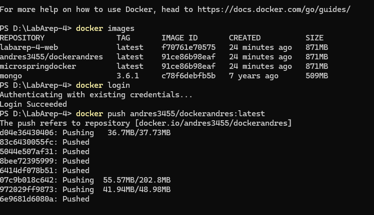
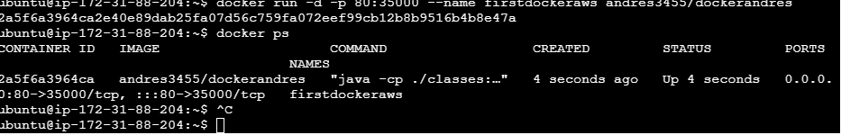

# Escuela Colombiana de Ingeniería
# Arquitecturas Empresariales

## Taller 4 Modularización con virtualización y introduccion a Docker

## Descripcion del laboratorio

En este laboratorio, se trabajó con el framework desarrollado previamente, con el objetivo de implementar concurrencia para mejorar su rendimiento. Además, se buscó optimizar la salida del programa para que fuera más clara y elegante. Finalmente, se realizó el despliegue de la aplicación utilizando instancias EC2 en AWS y contenedores Docker.


---
### Prerrequisitos

* [Maven](https://maven.apache.org/): Es una herramienta de comprensión y gestión de proyectos de software. Basado en el concepto de modelo de objetos de proyecto (POM), Maven puede gestionar la construcción, los informes y la documentación de un proyecto desde una pieza de información central.
* [Git](https://learn.microsoft.com/es-es/devops/develop/git/what-is-git): Es un sistema de control de versiones distribuido, lo que significa que un clon local del proyecto es un repositorio de control de versiones completo. Estos repositorios locales plenamente funcionales permiten trabajar sin conexión o de forma remota con facilidad.

* [Docker](https://www.docker.com/): Es una plataforma para desarrollar, enviar y ejecutar aplicaciones en contenedores. Permite empaquetar una aplicación y sus dependencias en un contenedor ligero y portátil, garantizando la consistencia en diferentes entornos.

---

## Arquitectura representada por Capas

```
┌────────────────────────────────────────────────┐
│           Capa de Presentación (Frontend)      │
│        ( HTML, JavaScript,CSS)                 │           
└────────────────────────────────────────────────┘
                        │
                        ▼
┌────────────────────────────────────────────────┐
│          Capa de Controladores (Server)        │
│  - @GreetingController                         │
│  - @MathController                             │
│  - Métodos con @GetMapping("/ruta")            │
└────────────────────────────────────────────────┘
                        │
                        ▼
┌────────────────────────────────────────────────┐
│        Capa del Framework Web (MicroSpring)    │
│  - WebFrameWork → Registra rutas y métodos     │
│  - RequestHandler → Ejecuta métodos dinámicos
|  - Response -> Maneja la respuesta
    - Request -> Maneja la petición 
└────────────────────────────────────────────────┘
                        


```


### Instalación

1) Debemos clonar el repositorio
```
https://github.com/andres3455/ArepLab3.git
```
2) Una vez clonamos, accedemos al directorio
```
cd ArepLab3
```
3) Construimos el proyecto
```
mvn package
```
---

## Ejecución

### Primera Forma
En la terminal de comando, utilizamos la sentencia:
```
mvn exec:java -"Dexec.mainClass"="edu.eci.arep.http.httpServer"  
```

### Segunda Forma
1) En la barra de navegación de nuestro IDE, buscamos la opción "Ejecutar".
   
2) Luego, elegimos la opción "iniciar depuración" o "Ejecutar sin depuración"


## Casos de uso

Una vez ejecutado, accedemos a la URL en un navegador

```
http://localhost:35000
```


Aquí podemos observar formato de nuestro servidor HTTP.


1) Primera Version, cargue el POJO desde la linea de comando

Utilizamos el siguiente comando para cumplir dicho objetivo

```
java -cp "target/classes" edu.eci.arep.microspring.Server.MicroServer edu.eci.arep.microspring.Server                                                      

```
Con esto logramos invocar el framework


como podemos ver, hemos puesto unas salidas de texto, para controlar el registro de rutas

2) Atiende la anotación @GetMapping 

Esta anotación,la habiamos creado en clase, por lo tanto, solamente debemos cambiar lo que queremos que nos regrese el servicio


3) Version final, busqueda de clases con una anotación

se crea un metodo dentro de la clase WebFrameWork, el cual nos va a permitir escanear un paquete dado para clases con la anotación @RestController y registrar sus metodos que tenga la anotación @ GetMapping

```
public static List<Class<?>> scanControllers(String packageName) {
        List<Class<?>> controllerClasses = new ArrayList<>();
        try {
            String path = packageName.replace(".", "/");
            URL resource = Thread.currentThread().getContextClassLoader().getResource(path);

            if (resource == null) {
                throw new RuntimeException("No se encontró el paquete base: " + packageName);
            }

            File directory = new File(resource.toURI());

            File[] classFiles = directory.listFiles((dir, name) -> name.endsWith(".class"));
            if (classFiles == null) {
                throw new RuntimeException("No se encontraron clases en el paquete: " + packageName);
            }

            for (File classFile : classFiles) {
                String className = packageName + "." + classFile.getName().replace(".class", "");
                Class<?> controllerClass = Class.forName(className);

                if (controllerClass.isAnnotationPresent(RestController.class)) {
                    controllerClasses.add(controllerClass);
                }
            }
        } catch (Exception e) {
            throw new RuntimeException("Error al escanear los controladores: " + e.getMessage(), e);
        }
        return controllerClasses;
    }

```
Deberia escanear la clase que contiene los siguiente metodos marcados con la anotación y cargarlos




Aqui podemos ver, que lo hace correctamente





4) Debe soportat @RequestParam


### Pruebas de su funcionamiento

A su vez tambien atiende el metodo hello, con parametros


## Pruebas

para ejecutar las pruebas, puede utilizar el siguiente comando 

```
mvn clean test

```


### Evidencia de las pruebas 


https://github.com/user-attachments/assets/1fc21334-1c9b-4d9f-a101-d4772bc3cffa


### Construido con

* [Maven](https://maven.apache.org/): Es una herramienta de comprensión y gestión de proyectos de software. Basado en el concepto de modelo de objetos de proyecto (POM), Maven puede gestionar la construcción, los informes y la documentación de un proyecto desde una pieza de información central.

* [Git](https://learn.microsoft.com/es-es/devops/develop/git/what-is-git): Es un sistema de control de versiones distribuido, lo que significa que un clon local del proyecto es un repositorio de control de versiones completo. Estos repositorios locales plenamente funcionales permiten trabajar sin conexión o de forma remota con facilidad.

* [GitHub](https://platzi.com/blog/que-es-github-como-funciona/): Es una plataforma de alojamiento, propiedad de Microsoft, que ofrece a los desarrolladores la posibilidad de crear repositorios de código y guardarlos en la nube de forma segura, usando un sistema de control de versiones llamado Git.

* [Java -17](https://www.cursosaula21.com/que-es-java/): Es un lenguaje de programación y una plataforma informática que nos permite desarrollar aplicaciones de escritorio, servidores, sistemas operativos y aplicaciones para dispositivos móviles, plataformas IoT basadas en la nube, televisores inteligentes, sistemas empresariales, software industrial, etc.

* [JavaScript](https://universidadeuropea.com/blog/que-es-javascript/): Es un lenguaje de programación de scripts que se utiliza fundamentalmente para añadir funcionalidades interactivas y otros contenidos dinámicos a las páginas web.

* [HTML](https://aulacm.com/que-es/html-significado-definicion/): Es un lenguaje de marcado de etiquetas que se utiliza para crear y estructurar contenido en la web. Este lenguaje permite definir la estructura y el contenido de una página web mediante etiquetas y atributos que indican al navegador cómo mostrar la información.

* [CSS](https://www.hostinger.co/tutoriales/que-es-css): Es un lenguaje que se usa para estilizar elementos escritos en un lenguaje de marcado como HTML.

* [Visual Studio Code](https://openwebinars.net/blog/que-es-visual-studio-code-y-que-ventajas-ofrece/): Es un editor de código fuente desarrollado por Microsoft. Es software libre y multiplataforma, está disponible para Windows, GNU/Linux y macOS.

## Autor

* **[Andrés Felipe Rodríguez Chaparro](https://www.linkedin.com/in/andres-felipe-rodriguez-chaparro-816ab527a/)** - [20042000](https://github.com/20042000)

## Licencia
**©** Andrés Felipe Rodríguez Chaparro. Estudiante de Ingeniería de Sistemas de la Escuela Colombiana de Ingeniería Julio Garavito
